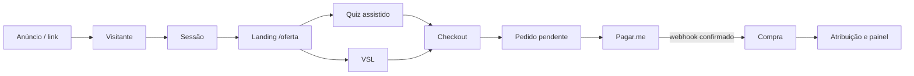

# TRACKING SYSTEM ARCHITECTURE — NutriMãe V1

Status: proposta para revisão. Este documento não autoriza implementação.

## 1. Objetivo e limite da V1

Responder com dados confiáveis: qual origem, campanha e criativo trouxeram cada visita, avanço no funil, pedido e compra confirmada.

Fluxo coberto:



Fora da V1: decisão automática por IA, previsão de LTV, bidding, personalização automática da página, integração direta com APIs de mídia e atribuição probabilística entre dispositivos.

## 2. Estado real encontrado

### Reutilizar

- Next.js 16 App Router, Supabase, Vercel e Pagar.me já estão integrados.
- `offers`, `orders`, `order_items`, `payments`, `subscriptions` e `webhook_logs` já são a fonte financeira operacional.
- `orders` já possui `utm jsonb` e `quiz_answers jsonb`.
- O webhook Pagar.me é idempotente por `(provider, provider_event_id)` e é a única fonte de liberação de acesso.
- Purchase server-side para Meta já ocorre após liberação do produto e não derruba o webhook em caso de falha.
- `/app/admin/metricas`, cache administrativo, cron e controle por `profiles.is_admin` são uma boa fundação para o painel.
- A landing `/oferta` já possui fase, assistente, VSL/hero e seleção de plano.

### Lacunas críticas

1. `trackEvent()` envia apenas para Meta Pixel; não existe trilha interna consultável.
2. Não existem `visitor_id`, `session_id`, identidade de clique ou atribuição persistente.
3. O checkout aceita UTM e quiz na API, mas os dois formulários atuais não enviam esses dados.
4. A VSL registra somente `VideoPlay`; não mede 25%, 50%, 75% e conclusão.
5. O “quiz” atual é composto pelo seletor de fase e pelo assistente de método/alergênico, mas suas respostas não chegam ao pedido.
6. Não existe catálogo de criativos nem gasto por criativo.
7. O Meta Pixel é carregado globalmente sem uma camada de consentimento observável.
8. O painel mostra receita bruta operacional, mas não receita líquida, CPA, ROAS ou funil por origem/criativo.
9. A interface chama regras determinísticas de “Sugestão da IA”; a V1 não deve alegar IA.
10. O webhook responde 200 após erro de processamento e marca o evento como `error`; sem reconciliação, uma falha pode permanecer sem retry automático.

## 3. Princípios arquiteturais

1. **Pagamento continua soberano.** Evento de browser nunca cria compra nem libera acesso.
2. **Tracking é aditivo e falha aberto.** Falha de analytics não bloqueia landing, quiz, checkout ou webhook.
3. **Evento crítico nasce no servidor.** `purchase_confirmed` vem somente do webhook confirmado.
4. **Identificadores, não PII.** Cookies de tracking contêm UUIDs, nunca e-mail, CPF, telefone ou dados do bebê.
5. **Raw e normalizado coexistem.** Preservar parâmetros recebidos e também campos normalizados.
6. **Sem dado não é zero.** CPA/ROAS aparecem como indisponíveis quando gasto ou atribuição faltarem.
7. **Versionar contratos.** Eventos têm versão explícita e validação por allowlist/Zod.
8. **UTC no banco, America/Sao_Paulo no painel.**

## 4. Arquitetura proposta

```mermaid
flowchart TB
  Browser[Landing / Quiz / VSL / Checkout] -->|POST /api/tracking/events| Ingest[Ingestão validada]
  Browser -->|visitor_id + session_id| Checkout[Checkout API]
  Ingest --> Events[(analytics_events)]
  Ingest --> Identity[(analytics_visitors / sessions / attributions)]
  Checkout --> Orders[(orders / subscriptions)]
  Pagarme[Pagar.me] --> Webhook[Webhook idempotente]
  Webhook --> Orders
  Webhook --> Outbox[(analytics_outbox)]
  Outbox --> Events
  Spend[CSV gasto de mídia] --> SpendDB[(ad_spend_daily)]
  Events --> Views[Views/materializações]
  Orders --> Views
  SpendDB --> Views
  Views --> Cache[(admin_metrics_cache v2)]
  Cache --> Dashboard[/app/admin/metricas]
```

### Componentes novos

- Biblioteca client `tracking`: identidade, consentimento, captura de campanha, fila e eventos.
- `POST /api/tracking/events`: ingestão first-party, pública e limitada.
- Contexto assinado de tracking no checkout para evitar confiar em UTM arbitrária enviada pelo cliente.
- Tabelas de visitante, sessão, atribuição, eventos, criativos, gasto e outbox.
- Views/materializações para funil, atribuição, criativos e finanças.
- Extensão do painel existente, sem criar segundo painel paralelo.

## 5. Identidade e sessão

- `visitor_id`: UUID aleatório first-party, persistente conforme consentimento e política de retenção.
- `session_id`: UUID novo após 30 minutos de inatividade ou quando uma nova campanha não direta começa.
- Usuária autenticada: associar `user_id` no servidor; nunca expor esse vínculo em Pixel.
- Checkout: copiar `visitor_id`, `session_id` e `attribution_id` para pedido/assinatura no momento da criação.
- Não tentar unir dispositivos na V1 antes do login ou da compra.

## 6. Modelo de dados proposto

Detalhes e campos estão nos documentos relacionados. Tabelas principais:

- `analytics_visitors`
- `analytics_sessions`
- `analytics_attributions`
- `analytics_events`
- `analytics_outbox`
- `marketing_creatives`
- `ad_spend_daily`
- extensão aditiva de `orders` e `subscriptions`
- views `analytics_funnel_daily`, `analytics_attribution_daily`, `analytics_creative_daily`, `analytics_financial_daily`

Não duplicar `offers`, `orders`, `payments` ou `subscriptions`.

## 7. Segurança, privacidade e consentimento

- RLS sem leitura pública das tabelas analíticas; escrita pública ocorre somente pela rota de ingestão usando service role no servidor.
- Payload máximo, esquema fechado, rejeição de chaves desconhecidas sensíveis e rate limit por IP/visitor.
- Proibir e-mail, telefone, CPF, nome e qualquer dado do bebê em `properties`.
- Meta Pixel condicionado a consentimento de marketing. O estado atual exige correção antes de considerar conformidade concluída.
- Analytics first-party mínimo deve ter base legal e retenção revisadas com responsável por LGPD; este documento não substitui parecer jurídico.
- Disponibilizar opt-out e remoção dos vínculos de tracking no fluxo de exclusão de conta.
- `webhook_logs.payload` pode conter dados pessoais do provedor: restringir retenção e acesso.

## 8. Confiabilidade

- `event_id` UUID único evita duplicação de eventos do navegador.
- Webhook mantém idempotência existente.
- `analytics_outbox` registra eventos financeiros depois da alteração financeira, processados de forma repetível.
- Job de reconciliação compara pedidos pagos, pagamentos e `purchase_confirmed` e cria alerta para divergências.
- Fila do browser usa `sendBeacon`/`keepalive`, lote pequeno e descarte controlado; nunca bloqueia navegação.
- Monitorar taxa de rejeição, atraso de evento, eventos órfãos, compra sem atribuição e custo sem criativo.

## 9. Dashboard V1

Estender `/app/admin/metricas` com:

- Receita bruta e líquida estimada, reembolso, chargeback e pendência.
- Visitantes, sessões e conversão por etapa.
- Origem/campanha/conjunto/anúncio/criativo.
- CPA e ROAS somente quando houver gasto válido.
- Funil da VSL e quiz.
- Cobertura de atribuição e saúde do tracking.
- Filtros: período, produto, plano, origem, campanha e criativo.

O painel deve priorizar desktop, preservar leitura mobile, informar atualização e distinguir carregando, vazio, indisponível e erro.

## 10. Rollout seguro

1. Aprovar esta arquitetura e resolver ambiguidades.
2. Criar branch `chatgpt/tracking-v1` após conferir trabalhos paralelos.
3. Aplicar schema aditivo e RLS em ambiente de teste.
4. Instrumentar identidade/consentimento e eventos não financeiros.
5. Transportar contexto até checkout/pedido.
6. Emitir compra server-side e executar reconciliação.
7. Criar importação manual de gasto e cadastro de criativos.
8. Estender cache e dashboard.
9. Rodar shadow mode sem usar os números para decisão.
10. Comparar pedidos e receita com Pagar.me; só então ativar painel como operacional.

## 11. Ambiguidades que exigem decisão antes de codar

1. O “quiz oficial” será o seletor de fase + assistente atual ou haverá uma rota própria?
2. Qual player/arquivo será a VSL real? O hero atual é apenas uma superfície clicável, sem duração observável.
3. Qual fonte de gasto na V1: CSV manual do Meta Ads ou integração direta? Recomendação: CSV manual.
4. Qual janela de atribuição operacional: recomendação V1 de 7 dias clique / 1 dia visual não será implementada para view-through sem dado confiável; first/last touch first-party continuam separados.
5. Qual política de retenção para eventos brutos, click IDs e logs de webhook?
6. Quais taxas entram na receita líquida: Pagar.me, impostos e reembolsos? Hoje essas taxas não estão modeladas.
7. Quais parâmetros identificam criativo nos anúncios atuais: `utm_content`, `creative_id` ou ambos?

## 12. Definição de pronto da V1

- Uma visita de campanha pode ser seguida até pedido e compra confirmada.
- First touch e last non-direct são reproduzíveis e auditáveis.
- Compra duplicada do webhook não duplica evento nem receita.
- Nenhum evento de browser libera acesso ou cria receita.
- Checkout funciona mesmo com tracking indisponível.
- Funil, receita e criativo reconciliam com as fontes financeiras dentro da tolerância definida.
- CPA/ROAS não são exibidos quando gasto ou atribuição não existem.
- Consentimento controla Meta Pixel e há opt-out.
- Testes de contrato, integração, idempotência, atribuição e reconciliação passam.
- Operação, rollback e diagnóstico estão documentados.

## Documentos relacionados

- [event-taxonomy.md](./event-taxonomy.md)
- [attribution.md](./attribution.md)
- [creative-model.md](./creative-model.md)
- [financial-events.md](./financial-events.md)
- [dashboard.md](./dashboard.md)
- [testing.md](./testing.md)
- [operations.md](./operations.md)
